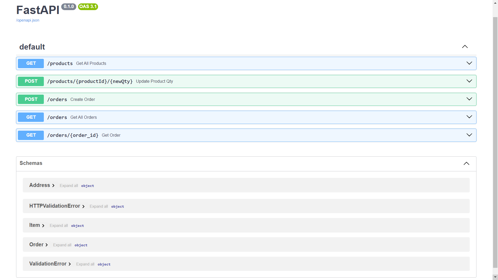

# E-Commerce Backend In FastAPI



---

## Running Locally

### MongoDB Setup
- First of all make sure to signup to [Mongo DB Atlas](https://www.mongodb.com/atlas) and create a cluster

- Create a database with the name ```mydb```

- Create 2 collections with the names
    - products
    - orders

- Store the connection ```URI``` (including password) in credentials.py 

### Running FastAPI server

``` bash
>>> git clone https://github.com/JayantTaneja/E-Commerce-Backend.git


>>> cd E-Commerce-Backend

>>> pip install -r requirements.txt

>>> uvicorn main:app --reload
```

---

## Features

- API to List all available products in the system


https://github.com/JayantTaneja/E-Commerce-Backend/assets/79043865/aac25363-fb5c-4872-9f3f-3708a623210f


- API to update product with ```productId``` to new available quantity ```newQty```


https://github.com/JayantTaneja/E-Commerce-Backend/assets/79043865/71d250e3-1bd2-4f5e-8c00-e7efa898a539


- Place an order

- Get All the orders

- Get order using ```orderId```
